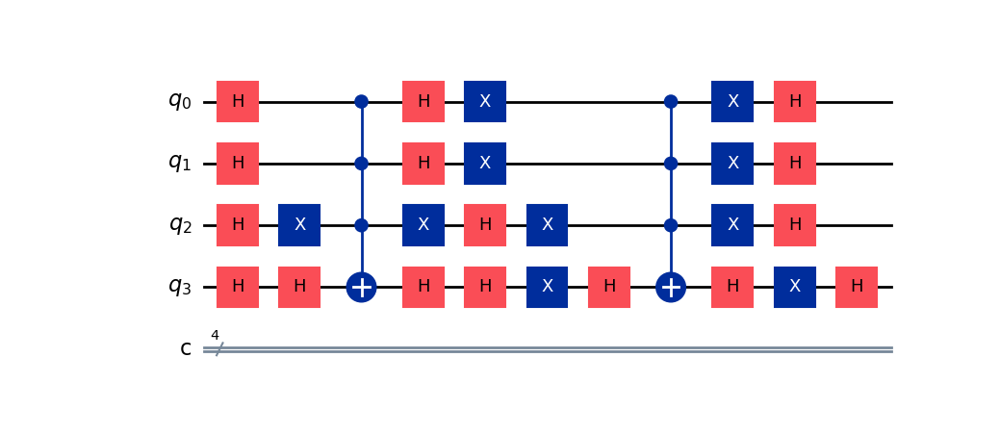

# QuantumCryptanalysis-HybridDES
I built a small scale DES (only one iteration instead of 16) and then built a quantum simulation to crack the encryption using Grover's Algorithm:
Please see full report for more details: [📄 View Full Project Report (PDF)](./report.pdf)

## 🔐 Algorithm Recap: HBEA Structure

### 🧠 High-Level Summary
1. Accept an email to generate a random key.
2. Store or retrieve a custom IP table and its inverse, unique to each email.
3. Encrypt 32-bit blocks by applying a Feistel structure, emulating DES encryption.
4. Decrypt by applying the same operations in order, using the ciphertext to retrieve the plaintext.

---

### 🔑 Key Generation
1. Hash a user-provided email to generate a random 32-byte (256-bit) key.
2. Apply the user's unique initial permutation to the key, then split and store it as two halves (16 bytes each).

---

### ✉️ Message Processing
3. Take the 32-byte plaintext message and apply the user’s unique initial permutation.
4. Store the permuted message as two halves, each 16 bytes.

---

### 🔒 Encryption Process
5. Expand the right half of the permuted plaintext using the standard DES expansion table (32 bits → 48 bits).
6. Expand the corresponding key block to match the expanded message block.
7. XOR the expanded key block with the expanded message block.
8. Pass the result through standard DES S-boxes (48 bits → 32 bits).
9. XOR the S-box output with the saved left half of the message.
10. Repeat this process for each block of plaintext, concatenating results to form the final ciphertext.

---

### 🔓 Decryption Process
11. Expand a 32-bit block of ciphertext into 48 bits using the expansion table.
12. Expand the corresponding key block similarly.
13. XOR the expanded key block and expanded ciphertext block.
14. Pass the result through the S-boxes to return to 32 bits.
15. XOR the S-box output with the original left half of the message block.
16. Repeat for all ciphertext blocks, concatenating results.
17. Apply the inverse permutation table to recover the original plaintext.

## ⚛️ Quantum Simulation: Grover's Algorithm

### 🎯 Goal
Simulate a quantum attack on HBEA using **Grover’s Algorithm**.

---

### 🧠 Overview
Grover’s Algorithm is a quantum search algorithm that searches **unsorted, unstructured databases in O(√N)** time—significantly faster than classical brute-force algorithms, which run in O(N) time.

---

### 🧪 Our Simulation
Our HBEA uses **SHA-256** to create a 256-bit key. In practice, Grover’s Algorithm would take approximately **2¹²⁸ iterations** to find this key—still far too many for current quantum or classical machines.

To demonstrate the concept feasibly, we **scale down** the key size to **4 bits**, reducing the search space from 2²⁵⁶ to just **2⁴ = 16 possibilities**. This small scale is computationally manageable on a laptop using **Qiskit**, while still illustrating the core principles of Grover's Algorithm.

---

### 📈 Justification
Grover’s Algorithm scales as **O(√N)** regardless of the size of N. Therefore, we can extrapolate insights from small-scale simulations to understand the algorithm’s theoretical performance on a **256-bit target**.

---

### 🛠️ Methodology

1. **Initialization**  
   - Constructed a quantum circuit with **4 qubits** and **4 classical bits**.

2. **Superposition**  
   - Applied **Hadamard gates** to all qubits to create a uniform superposition across all 16 states.

3. **Oracle Construction**  
   - Targeted key: `|1011⟩`  
   - Flipped qubits where the target bit was `0`, applied **multi-controlled-Z**, then unflipped — marking the target state by inverting its amplitude.

4. **Diffusion Operator**  
   - Applied another round of **Hadamard**, **X**, and **multi-controlled-Z** gates to amplify the target state by reflecting amplitudes over the mean.

5. **Measurement & Simulation**  
   - Added measurement gates to all qubits.  
   - Ran the circuit **1024 times** to observe frequency trends.

---

### 📊 Results

- Target state `|1011⟩` occurred **455 out of 1024 times**.
- All other states ranged between **27–47 measurements**.
  
This demonstrates a **successful implementation of Grover’s Algorithm**: the amplitude of the correct state was significantly amplified while incorrect states remained low. This confirms Grover’s power in **quantum search through unstructured spaces**.

## ⚙️ Methodology

1. **Initialization**  
   Created a quantum circuit with **4 qubits** and **4 classical bits**.

2. **Superposition**  
   Applied **Hadamard gates** to all qubits, placing them in a uniform superposition of all 16 possible solutions.

3. **Oracle Construction**  
   Marked the target key `|1011⟩` by flipping any qubit where the target bit was 0, applying **multi-controlled-Z** operations, then unflipping — inverting the amplitude of the target state.

4. **Diffusion Operator**  
   Applied another round of **Hadamard**, **X**, and **multi-controlled-Z** gates to reflect the amplitudes over the mean (a.k.a. the Grover diffuser).

5. **Measurement and Simulation**  
   Added measurement gates to all qubits and simulated the circuit **1024 times** to observe statistically meaningful trends.

---

## 📊 Results

- **Target key `|1011⟩` appeared 455 out of 1024 times.**
- All other states stayed consistently low (between 27–47 occurrences).
- The high measurement count for the target key shows Grover’s Algorithm successfully amplified the correct state’s amplitude, while minimizing others — demonstrating its power in quantum search.

---

## 🖼️ Visualizations

### 📍 Before Simulation / Measurement

**Figure 1**  
_Bloch spheres showing the initial state of the 4 qubits:_

**Figure 2**  
_3D representation of the quantum statevector prior to measurement:_

---

### 📈 After Simulation / Measurement

**Figure 3**  
_Frequency each possible state was observed after running the circuit 1024 times:_

**Figure 4**  
_Histogram of the measurement results showing amplification of `|1011⟩`:_

**Figure 5**  
_Final Grover circuit with gates as observed post-measurement:_

